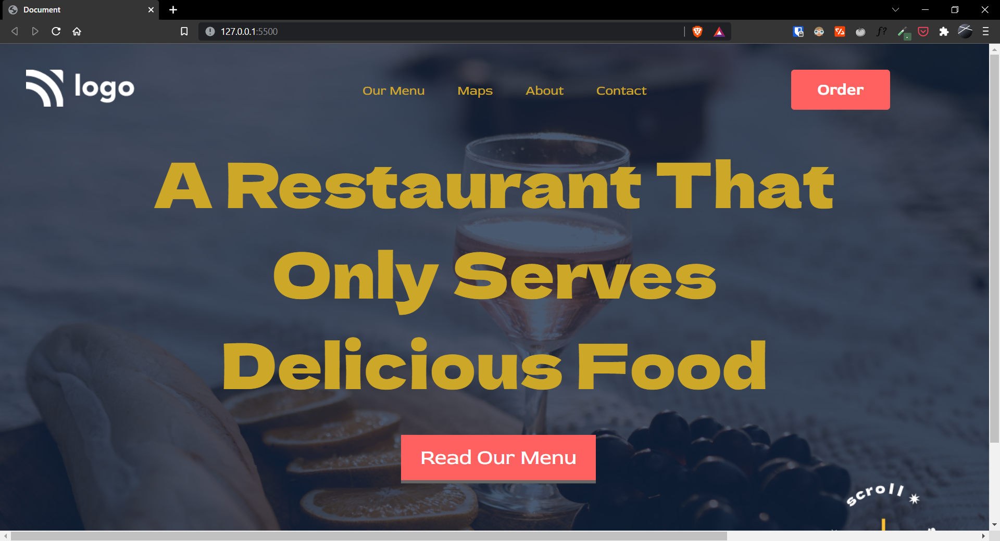

# Project-02 | Food Restaurant Home Page

Hi there,
I'm Wasit Ali and this is my 2nd project on HTML and CSS.

## 🖥 Preview

`note:` please make sure the preview screen is `1920 x 1080` and the web site is not responsive.

🚀 [Live Preview](https://leafy-hotteok-6e845d.netlify.app/](https://live-class-project-02-eight.vercel.app/)

## 🛠️ What I have learned in this project?

- Clear understanding of CSS positioning property.
- Use of background image along with a background color.

## ⏲ Time taken to finish the project

- It took me around 5-6 hours to complete this project.
